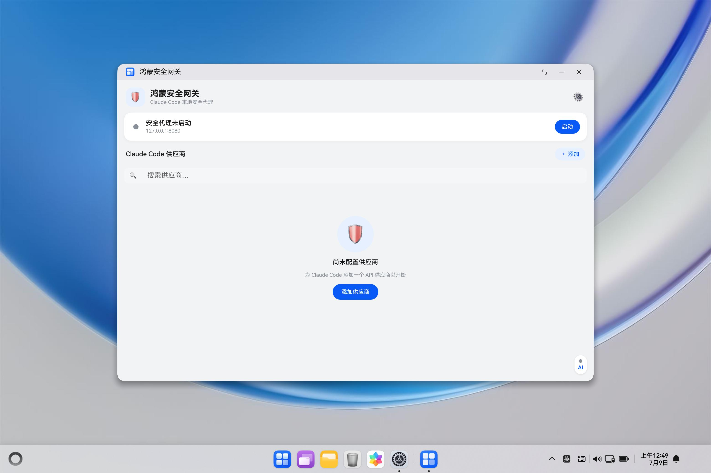
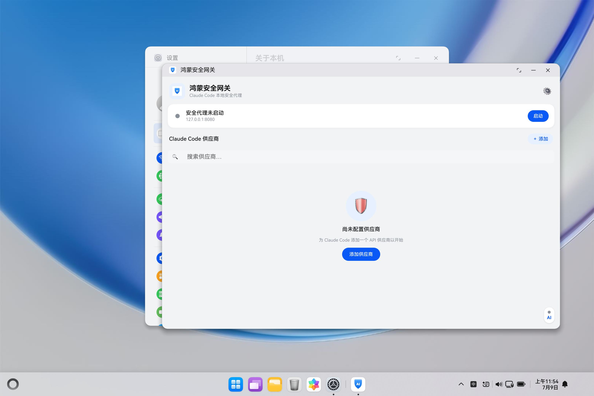

# AIGate — LLM Agent Gateway for HarmonyOS

[中文](README.md)

AIGate is a local LLM API forwarding gateway that runs on **HarmonyOS 2in1 (PC) devices**. It listens on a local port, forwards requests from Agent tools (Claude Code, etc.) to the upstream LLM provider configured in the app, and injects the real API key on the server side — keys live only in the app's ArkData preferences and are never written into the Agent's own configuration.

## Features

- **Local forwarding proxy** — listens on `127.0.0.1:8080` (port configurable in-app) and forwards Agent requests to the current provider's `baseUrl`; SSE streaming is passed through transparently.
- **Keys never leave the gateway** — the real API key is injected server-side into request headers (`x-api-key` / `Authorization: Bearer` / `x-goog-api-key`), stored only in preferences, never persisted to Agent config (Claude, Codex, and OpenCode local configs receive only a placeholder token).
- **HTTPS upstreams** — vendored mbedTLS 3.6 provides TLS (mongoose `MG_TLS_MBED` backend); GLM / Baidu providers verified end-to-end.
- **Security detection** — a pluggable C++ rule engine screens **request bodies** before forwarding: password leaks, prompt injection, and context injection (conservative WARN-level, logged only); hits → 403. **Response-side detection is wired (M4)**: SSE events are scanned streaming (malicious tool use / password leak hits are blocked and an SSE error event is sent back to the client). Rules support custom keywords/patterns and per-rule hit counts. Request headers are deliberately excluded so legitimate `Bearer`/`x-api-key` values are not flagged.
- **System tray persistence** — status-bar tray icon; closing the window hides the ability (`hideAbility`) instead of exiting, keeping the process and proxy alive; click the tray icon to bring the window back.
- **In-app provider management** — per-channel provider lists, presets, and CRUD for Claude Code, Codex, and OpenCode; preferences are the single source of truth; switching providers hot-updates the running proxy.
- **Local Agent configuration integration** — the settings panel links Claude `settings.json`, Codex `config.toml`, or OpenCode `opencode.json`; only the active channel is redirected while the proxy runs, and the original file is restored on stop, channel switch, or unlink.

## Screenshots

| Main UI | System tray |
| --- | --- |
|  |  |

## Quick Start

### Requirements

- Windows + Git Bash (this repo's development environment)
- DevEco Studio SDK, with `DEVECO_SDK_HOME` pointing to the SDK root
- `hvigorw`, `node`, `ohpm`, MinGW `g++`, and `hdc` on PATH
- Target device: HarmonyOS 2in1 (PC) hardware or emulator

### Build / Install / Launch

From the repository root:

```bash
# Sync dependencies
ohpm install

# Build the HAP (C++ is compiled with the BiSheng compiler)
DEVECO_SDK_HOME="D:/Program Files/Huawei/DevEco Studio/sdk" \
  hvigorw --mode module -p product=default assembleHap \
  --analyze=normal --parallel --incremental --no-daemon
# Output: entry/build/default/outputs/default/entry-default-unsigned.hap

# Install / launch (paths MUST be relative; hdc mangles POSIX /e/... paths)
hdc install -r entry/build/default/outputs/default/entry-default-unsigned.hap
hdc shell "aa start -a EntryAbility -b com.huawei.myapplication"
```

> If installation fails with `9568332 install sign info inconsistent`, run `hdc uninstall com.huawei.myapplication` first and reinstall.

## Usage

1. Open the app and add a provider in the provider panel (upstream `baseUrl`, API key, model — preset templates available).
2. Start the proxy (default `127.0.0.1:8080`; port configurable in the settings panel).
3. In Settings, link the local config for the active channel: Claude `~/.claude/settings.json`, Codex `~/.codex/config.toml`, or OpenCode `~/.config/opencode/opencode.json`, using the system file picker.
4. While the proxy runs, the active channel configuration points to `http://127.0.0.1:<port>` with a placeholder token; the original file is restored on stop, channel switch, or unlink.
5. Requests from the active channel now flow through the gateway, which injects the real key.

## Architecture

```
UI (Index.ets, pure view)
  → GatewayController (orchestration / use-case layer)
    → { ProviderRepository, SettingsRepository, ProxyService }
      → NAPI (libentry.so, module name "entry")
        → hmsec::ProxyServer (mongoose event-driven forwarding + mbedTLS + security detection)
```

See [docs/ARCHITECTURE.md](docs/ARCHITECTURE.md) for details,
[docs/DEVELOPMENT.md](docs/DEVELOPMENT.md) for the development guide, and
[docs/BACKGROUND.md](docs/BACKGROUND.md) for the project's background and design
motivation.

## Roadmap

- ~~Dynamic-library plugin mechanism~~ (landed in M2: pure C ABI + `dlopen`, see `entry/src/main/cpp/include/aigate_plugin.h`); ~~response-side detection plugin wiring~~ (landed in M4); next: wiring transform plugins
- ~~Multi-protocol recognition (Anthropic / OpenAI / Gemini) + smart routing~~ (landed in M3: protocol_adapter + router, model-prefix/protocol/path matching, visual configuration in ConfigPanel)
- ~~Response-side security detection wiring (landing the malicious tool-use rule) and context-injection detection~~ (landed in M4: ResponseScanner streaming scan + context_injection rule + custom rule terms / hit counts)
- ~~Theme customization~~ (landed in M5: system/light/dark switching + blue/green/violet skin packs, runtime skinning via AppStorage)
- Next: transform-plugin wiring, protocol conversion (OpenAI ↔ Anthropic), and Gemini CLI channel support

## Acknowledgements

- [cc-switch](https://github.com/farion1231/cc-switch) — the UI and provider model are ported from this project
- [mongoose](https://mongoose.ws/) 7.22 — networking stack (Cesanta, GPL-2.0-only / commercial dual license)
- [mbedTLS](https://github.com/Mbed-TLS/mbedtls) 3.6 — TLS backend (Apache-2.0)

## License

This project is released under **GPL-2.0-only** — see [LICENSE](LICENSE). Vendored components and their licenses are listed in [NOTICE](NOTICE): because of mongoose's dual-license terms, closed-source distribution requires a Cesanta commercial license or replacing the networking stack.

Contributions are welcome — please read [CONTRIBUTING.md](CONTRIBUTING.md) first.
